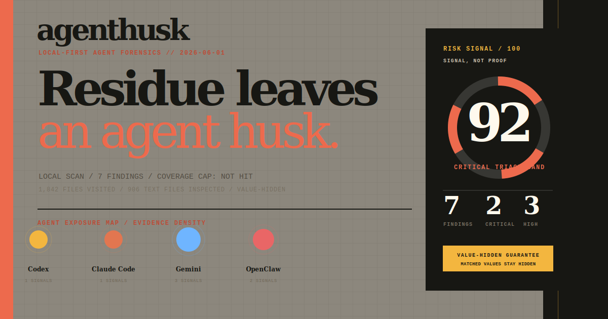

# AgentHusk

**Find secret-shaped residue left in local AI coding-agent storage before it becomes an incident.**

AgentHusk is a local-first forensic scanner. It inspects known agent directories without intentionally modifying source artifacts, flags secrets and risky residue, and keeps matched content values out of its default anonymized reports. It writes local report artifacts containing short fingerprints so repeated matches can be grouped without copying a matched credential into another artifact.

No external API. No upload. No telemetry.

AgentHusk does not start configured MCP servers, execute discovered commands, or inspect live agent traffic. Its scope is deliberately narrower: static local residue after the agent has run.



## 30-second quickstart

Requires Node.js 20 or later.

```sh
npx agenthusk demo
npx agenthusk scan
```

`demo` creates a safe synthetic report. `scan` inspects the supported agent directories that exist under your home directory and writes a local report for review.

Install globally if you prefer a persistent command:

```sh
npm install -g agenthusk
agenthusk demo
agenthusk scan
```

## What it detects

AgentHusk currently looks for:

- Secret-shaped values, including common API keys, access tokens, bearer tokens, webhook URLs, and assigned secret values.
- The same detected secret appearing in more than one scanned file, grouped by a short fingerprint.
- Environment-file copies, shell-history files, and locally retained agent session transcripts.
- Sensitive residue files readable by other local users and agent directories traversable by other local users.
- MCP server configuration declarations that deserve a trust-boundary review.
- Coverage gaps such as oversized files that were not content-scanned.

Findings are leads for review, not proof of compromise.

The report's aggregate risk signal is a visual triage aid, not a security grade or proof that a machine is safe. Use the finding evidence and coverage section to decide what to inspect locally.

## Trust model

AgentHusk is designed to add less sensitive residue than it finds:

- AgentHusk does not intentionally edit, delete, quarantine, rotate, or upload scanned source artifacts. It does write the requested local report artifacts.
- The scanner does not call external APIs and does not send telemetry.
- Matched content values are not copied into content-derived report fields. A per-run random HMAC key produces a 32-character fingerprint for grouping matches within that report.
- Fingerprints are intentionally not stable across separate runs.
- Reports anonymize source paths by default. They still contain metadata such as anonymized paths, line numbers, permission modes, and finding details. Review reports before sharing them.
- Raw source paths are included only when you explicitly pass the unsafe `--show-paths` option. A raw path can itself contain sensitive text, including a value also present in file content.
- The original secret, if any, remains in the source file until you remediate it.

Run scans against a snapshot or copied tree when possible, as an ordinary user. Avoid scanning a live writable tree, FUSE or network mount, or running AgentHusk with elevated privileges. The scanner skips symlinks, but it is not designed to defend against a concurrently changing or adversarial filesystem.

## Supported agents

The default scan checks these known locations under the current user's home directory:

| Agent | Location |
| --- | --- |
| Codex | `~/.codex` |
| Claude Code | `~/.claude` |
| Gemini | `~/.gemini` |
| OpenClaw | `~/.openclaw` |
| Hermes | `~/.hermes` |
| Cursor | `~/.cursor` |
| Windsurf | `~/.windsurf` |
| OpenCode | `~/.config/opencode` |
| Continue | `~/.continue` |
| Cline | `~/.cline` |

Support means that AgentHusk knows where to look. It does not imply affiliation with, endorsement by, or complete coverage of any agent.

## Useful options

By default, AgentHusk writes `agenthusk-report.html` and `agenthusk-report.json` in the current directory. On POSIX platforms, reports are created with owner-only mode `0600`. Windows ACL enforcement is not implemented.

```sh
npx agenthusk scan --root /path/to/review --max-files 5000
npx agenthusk scan --root /path/to/review-copy --max-bytes 8388608
npx agenthusk scan --card agenthusk-card.svg
npx agenthusk demo --out demo/report.html --json demo/report.json --card demo/card.svg
```

Use `--root` to scan an explicit directory instead of the default known roots; repeat it to scan more than one. Run `npx agenthusk help` for the full option list.

Paths are anonymized by default so reports are safer to review and share. Use `--max-bytes` to change the per-file content-inspection limit. The SVG share card omits paths entirely.

`--show-paths` is an unsafe option for local investigation only. For roots under your home directory it includes local relative paths. For external explicit roots it keeps the absolute root hidden but includes descendant names. A path can itself contain sensitive text, so do not use this option for artifacts that may be shared.

## Limits

AgentHusk is a narrow forensic aid, not a secret manager, malware scanner, or compliance control.

- Pattern matching can produce false positives and false negatives.
- Files larger than 4 MiB are skipped for content inspection by default.
- Aggregate content reads are capped at 64 MiB by default.
- A scan is capped at 20,000 visited files and a maximum traversal depth of 14 by default.
- Discovered symlinks, symlinked final roots, and roots under the selected home with symlinked descendant components are skipped. `.git`, `node_modules`, and `coverage` directories are not traversed.
- Binary files are not content-scanned.
- The scanner cannot detect secrets that do not match its current rules, residue outside scanned roots, or credentials that already left the machine.
- Scanning a live writable tree, FUSE mount, network mount, or attacker-controlled filesystem can produce inconsistent results or expose the scanner to filesystem races. Prefer a snapshot or copied tree.
- A clean report is not evidence that a machine or account is safe.

## What to do with a finding

1. Review the referenced source file locally. Do not paste the underlying value into an issue.
2. Rotate or revoke a credential if exposure is possible or retention is unexpected.
3. Remove stale residue or restrict permissions where appropriate.
4. Re-run the scan and inspect the new local report.

## Development

```sh
npm test
npm run check
npm run smoke:pack
```

See [CONTRIBUTING.md](CONTRIBUTING.md) before changing detection or redaction behavior. The scanner boundary is documented in [docs/ARCHITECTURE.md](docs/ARCHITECTURE.md). Planned work is tracked in [docs/ROADMAP.md](docs/ROADMAP.md). For usage questions, read [SUPPORT.md](SUPPORT.md). For security reports, read [SECURITY.md](SECURITY.md). Maintainers can use [docs/RELEASE.md](docs/RELEASE.md) for the publication checklist.

## License

MIT
